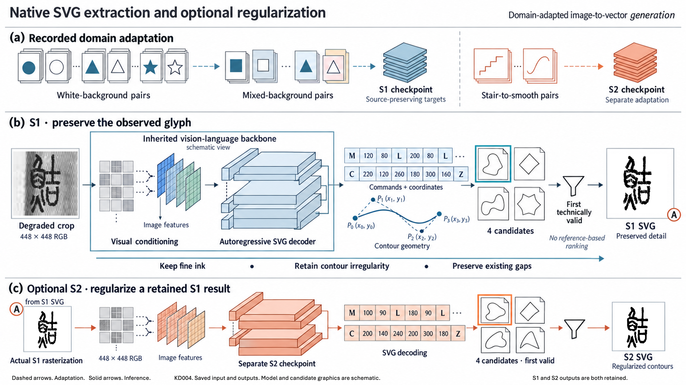
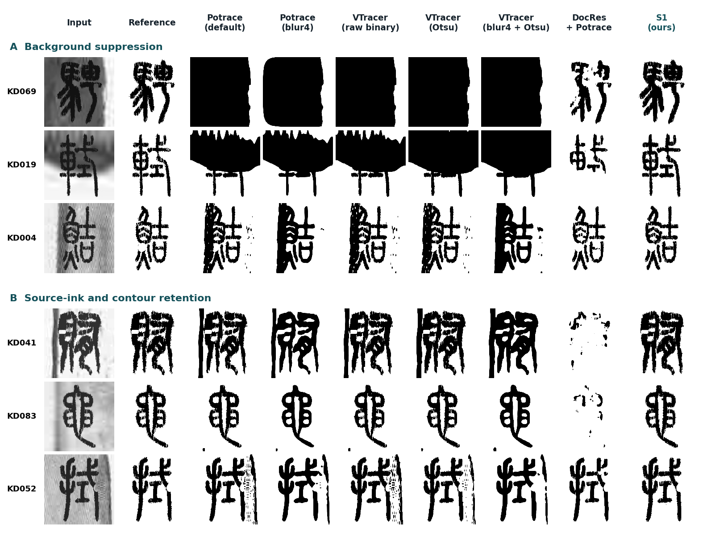
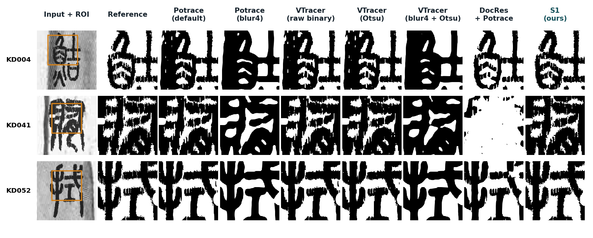
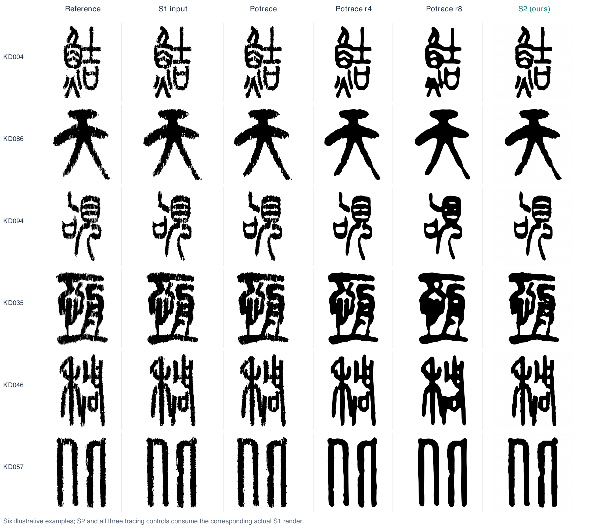

# Detail-Preserving Vectorization of Degraded Chinese Glyphs

**Keep the character. Keep its details.**

A research project on extracting editable SVG contours from degraded Chinese glyph images, with source-preserving extraction (S1) and optional contour regularization (S2).

## Why this problem?

The project is motivated by the limited availability and uneven quality of real bamboo- and wooden-slip images available for development. Faithful extraction must separate background interference from the observed glyph without removing fine marks, contour irregularities or existing gaps.

Controlled synthesis provides known source geometry and recorded degradations. It supports reproducible, output-independent measurements of missing ink and residual background. The main experiment concerns new degradation instances within the trained font and glyph domain, not unrestricted historical-manuscript generalization.

## Intended uses

The central goal is high-quality extraction of scalable, editable, detail-preserving single-glyph contours. Intended uses include character collections, visual comparison of glyph variants, digital exhibitions, publication illustrations and subsequent vector editing. These are application directions, not separately benchmarked downstream outcomes.

## Data design

The project also addresses limited clean glyph–SVG paired supervision. The archived synthesis pipeline applies shape and width variation, edge perturbation, internal holes and local ink deletion, then composites the damaged foreground with background crops. These effects were designed around observed slip-image phenomena. The extraction reference retains the damaged foreground before compositing, so S1 is not asked to reconstruct the pristine font glyph. Real-image inspiration is not a claim of statistically validated synthetic-to-real equivalence.

## Workflow

- **S1:** image-conditioned native SVG generation, prioritizing source fidelity.
- **Selection:** four actual candidates; first technically valid output; no reference-based ranking.
- **S2:** optional regularization of the actual selected S1 rasterization; both SVG outputs retained.
- The model backbone and SVG representation are inherited from OmniSVG. This project investigates domain adaptation and extraction behavior, not a new foundation-model architecture.

## Illustrative comparisons

Examples were selected after inspecting saved results to explain strengths. They are not a substitute for full-test statistics or an estimate of success rate. Inputs, saved candidates and method outputs were not reselected or cleaned up for these displays.

## Full main-test results

100 new degradation instances, nine training-covered fonts; same 448-pixel RGB input and common 512-pixel evaluation canvas. Values are per-input means.

| Method | Inputs | Missing ink (%) ↓ | Far background (%) ↓ | IoU ↑ |
|---|---:|---:|---:|---:|
| S1 (ours) | 100/100 | 4.228 | 0.0819 | 0.8641 |
| Potrace default | 100/100 | 2.887 | 2.0878 | 0.8552 |
| Potrace blur4 | 100/100 | 5.008 | 2.2688 | 0.7786 |
| VTracer raw binary | 100/100 | 2.356 | 2.1694 | 0.8377 |
| VTracer Otsu | 100/100 | 2.469 | 1.9657 | 0.8497 |
| VTracer blur4 + Otsu | 100/100 | 2.051 | 2.6218 | 0.7630 |
| DocRes + Potrace | 100/100 | 16.481 | 0.0598 | 0.7897 |

S1 suppresses more far-background residue than the five tracing recipes and omits less reference ink than generic DocRes followed by tracing. Four tracing recipes omit less ink than S1; DocRes leaves less mean far-background residue. Neither primary endpoint compensates for the other.

Official OmniSVG, StarVector and LIVE were not run on this main test (0/100 each); earlier stopped or blocked runs are not full-test failures. Base glyphs and fonts are training-covered; background sources may overlap with earlier material. S1 is domain-trained and DocRes is a generic public model, so this is not a training-matched architecture ablation. These geometric measurements do not certify review-free use or historical semantic fidelity.

## Repository scope

This repository is a project showcase: overview, illustrative figures and aggregate results. It does not currently release training code, checkpoints, original manuscript images, font files or private per-example records. No license for third-party materials or model weights is implied. Publication status and further releases will be updated when confirmed.

The static project page is in `index.html`. It has no analytics, external font requests or remote JavaScript dependencies.
